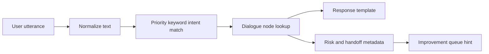

# Architecture

Voice Agent Lab is intentionally small and reviewable.

## Core Files

- `configs/intents.json`: Intent IDs, labels, priorities, keywords, and default nodes.
- `configs/responses.json`: Synthetic response templates with tone and risk metadata.
- `configs/dialogue_flow.json`: Node goals, terminal behavior, handoff behavior, and global safety guards.
- `src/engine.js`: Deterministic matching and routing engine.
- `examples/synthetic_turns.jsonl`: Regression fixtures.
- `schemas/improvement_record.schema.json`: Shape for unknown or risky turn review.

## Design Principles

- Deterministic first: the default engine does not call an LLM.
- Synthetic fixtures only: no real calls, recordings, or transcripts.
- Reviewable metadata: responses include risk and handoff fields.
- Human escalation is explicit: high-risk turns should not be hidden inside free-form text.
- Multilingual-ready: the example config includes English and a few Chinese synthetic utterances.

## Extension Points

- Add an ASR adapter that writes text into `simulateTurn`.
- Add a TTS adapter that speaks `response_text`.
- Add a queue writer for `improvement_hint`.
- Add a validator that checks config files against JSON Schema.
- Add a UI for non-technical reviewers to test rule changes.
